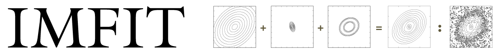

<!-- # Imfit -->

Imfit
([http://www.mpe.mpg.de/~erwin/code/imfit/](http://www.mpe.mpg.de/~erwin/code/imfit/)) 
is an open-source C++ program for fitting astronomical images
(primarily of galaxies) in FITS format. It is fast, flexible, and designed to be easily
extended with new functions for model image components.

Pre-compiled binaries for Linux and Mac OS X, along with documentation
and example files, can be found [at the main web
page](http://www.mpe.mpg.de/~erwin/code/imfit/index.html#downloads), as
can a condensed source-code distribution suitable for local compilations and for
making your own modifications.

A basic [tutorial](http://www.mpe.mpg.de/~erwin/code/imfit/markdown/index.html) is also available.

The paper describing Imfit can be found here: 
[Erwin 2015](http://adsabs.harvard.edu/abs/2015ApJ...799..226E).

<!-- 
ArXiv version:

 -->

DOI for current release (v1.4), archived at Zenodo:

## About the code at this Github site

This repository hosts the complete codebase, including regression
and unit tests, miscellaneous extra tests and notes, and assorted
(nonessential) auxiliary programs. If all you want to do is use Imfit to
model images, it's probably simpler to grab the precompiled
versions (or the basic source-code tarball) from [the main Imfit
site](http://www.mpe.mpg.de/~erwin/code/imfit/).

But if you're more comfortable forking things on Github, now you can!
(Feel free to open an issue if you find a bug or want to suggest a feature --
or just email me directly [erwin at sigmaxi.net].)

## Requirements

Building Imfit requires the following libraries:

* [FFTW](http://www.fftw.org) (version 3)
* [CFITSIO](http://heasarc.gsfc.nasa.gov/fitsio/fitsio.html) (version 3)
* [NLopt](http://ab-initio.mit.edu/wiki/index.php/NLopt) -- optional, but strongly recommended
* [GSL](http://www.gnu.org/software/gsl/) (GNU Scientific Library) -- optional, but strongly recommended

Imfit uses [SCons](http://scons.org) as the build tool,
and should build under any version of GCC from 4.2 onward. 

See the "Getting and Installing Imfit" chapter of the documentation
-- [imfit_howto.pdf](http://www.mpe.mpg.de/~erwin/resources/imfit/imfit_howto.pdf) -- for more details. 

## License

Imfit is licensed under version 3 of the GNU Public License.
